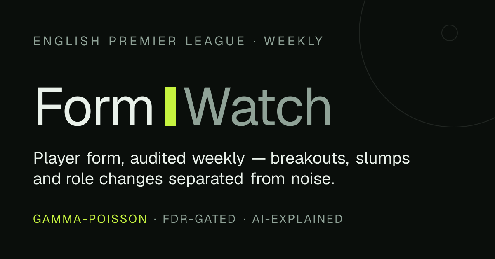
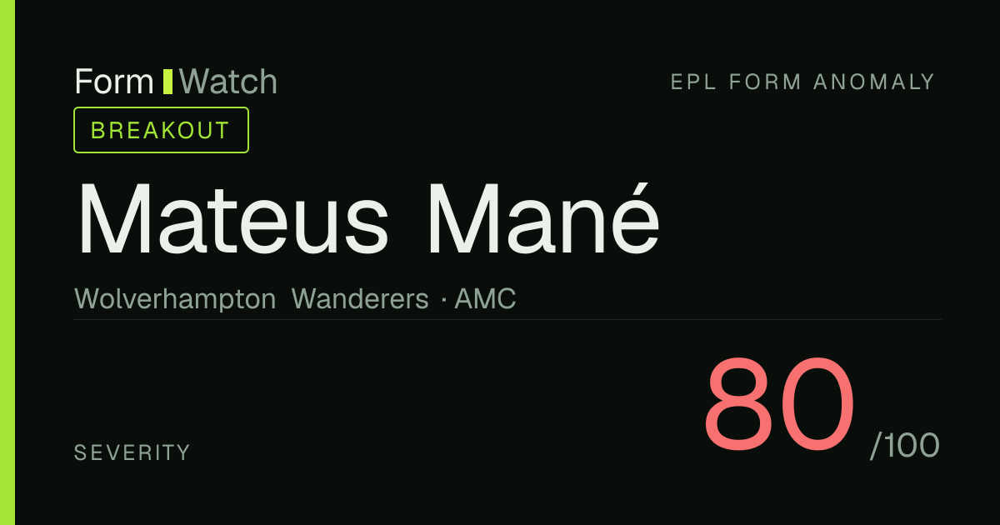
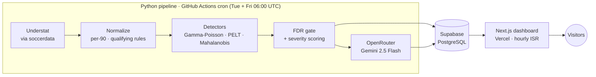

# FormWatch

**Bayesian anomaly detection for English Premier League player form.**

FormWatch monitors every EPL player's match-by-match output, separates real
form changes from small-sample noise with proper statistics, and explains
each anomaly in plain language with an AI narrative. A Python data-science
pipeline runs the detection; a Next.js dashboard serves the results.



> Football "form" is debated constantly and quantified almost never. A striker
> takes three or four shots a game, so a six-match "recent form" window holds
> barely two goals' worth of signal — at that sample size naive statistics
> fire false alarms on pure randomness. FormWatch applies Bayesian estimation,
> change-point detection and false-discovery-rate control to tell a genuine
> slump from a cold week.

🔗 **Live:** _add your Vercel URL_ · 📊 **[Methodology write-up](#how-detection-works)** · 🧪 **[Backtest](pipeline/BACKTEST.md)**

---

## What it does

- Ingests two EPL seasons of per-match player data from **Understat** (weekly, automated)
- Maintains a **Bayesian posterior** over each player's per-90 rate for five metrics, carried forward across seasons
- Runs **three detectors** (Gamma-Poisson, PELT change points, Mahalanobis profiling) and types each anomaly into one of six categories
- Gates every candidate through **Benjamini-Hochberg FDR** so the board stays honest, then scores severity 0–100
- Generates a **structured-JSON AI narrative** (Gemini 2.5 Flash) for high-severity anomalies, cached so unchanged evidence never re-bills
- Presents it all on a dashboard with an **interactive explainer**, **leaderboards**, **player timelines** and a full **methodology page**
- Runs at **$0/month** on free tiers (Supabase, Vercel, GitHub Actions, OpenRouter)

---

## Dashboard

Six routes, each a React Server Component reading Supabase directly via Drizzle
(hourly ISR), with skeleton loading states and graceful offline/empty states:

| Route | Purpose |
|---|---|
| `/` | **Anomaly board** — active anomalies ranked by severity, filterable by type / team / severity |
| `/anomaly/[id]` | **Detail** — AI narrative, baseline-vs-recent bars, reconstructed Gamma posteriors, triggering matches, full evidence audit |
| `/player/[id]` | **Timeline** — composite form index with change-point and anomaly markers, plus anomaly history |
| `/leaderboards` | **Overperformers / Breakout watch / Regression watch**, sortable |
| `/methodology` | **The write-up** — naive baseline vs Bayesian, the FDR gate, with live linked examples |
| `/how-it-works` | **Interactive explainer** — simulate a noisy season, drag the posteriors apart, work the FDR gate and the severity formula |

Every shared link gets a generated Open Graph card with the player, type and severity:



> _Screenshots of the live pages go in [`docs/screenshots/`](docs/screenshots) once deployed._

---

## Architecture



The pipeline owns the schema and is the only writer (Supabase service role).
The app reads through a pooled, read-only connection — Row-Level Security
allows public `SELECT` only, and the service key never ships to the client.

---

## How detection works

Three detectors layer on top of each other. The full statistical treatment
lives on the in-app **`/methodology`** page and in
[`pipeline/BACKTEST.md`](pipeline/BACKTEST.md); the short version:

**Naive control (the baseline to beat).** A rolling z-score — last 3 matches
vs a 10-match baseline, flagged at `|z| ≥ 2`. It has no concept of sample
size and tests everyone on everything every week. Its verdict is stored
alongside every real detection and shown on the methodology page as the
documented comparison.

**Detector A — Gamma-Poisson posteriors (core engine).** Each count metric
is a Poisson process with a Gamma prior over its per-90 rate. Two posteriors
per player and metric: a slow **baseline** over full history, and an
exponentially-weighted **recent-form** posterior over the last six matches. An
anomaly is *nominated* when the 90% credible intervals stop overlapping or the
KL divergence exceeds **1.5**. Posteriors carry across seasons, so a veteran
enters August with a tight prior while a newly-promoted player starts wide and
the system withholds judgment — exactly what a rolling average cannot do.

**Detector B — PELT change points.** Per-90 involvement metrics are z-scored
and averaged into one composite signal; PELT (RBF cost, 4-match minimum
segment, penalty **1.5**) finds regime shifts. This is the line drawn on every
player timeline.

**Detector C — Mahalanobis profiling.** Distance between the recent
involvement profile and the player's historical centroid decides whether the
*shape* of their game moved, classifying the anomaly by direction.

**The gate.** ~300 eligible players × 5 metrics is >1,000 hypotheses a week.
**KL nominates, FDR gates**: nomination is cheap, then every candidate's
p-value goes through Benjamini-Hochberg at **q = 0.15**. Survivors get a
severity from posterior separation, persistence and how comfortably they
cleared the gate:

```
severity = 40 · min(KL / 3, 1)          # evidence strength
         + 30 · min(weeks / 3, 1)        # persistence
         + 30 · (1 − min(p / 0.15, 1))   # significance
```

The board defaults to **severity ≥ 60**; the full list is one filter away.

### Anomaly taxonomy

| Type | Signature | Narrative angle |
|---|---|---|
| `BREAKOUT` | involvement up, or goals + xG rising together | a new level forming |
| `FINISHING_SLUMP` | goals down, xG holds | chances still coming, finishing cold — likely to normalize |
| `FORM_COLLAPSE` | output and underlying both down | a genuine slump |
| `OVERPERFORMANCE_RISK` | goals ≫ xG over the window | regression candidate / fantasy sell-high |
| `ROLE_CHANGE` | change point + shifted profile | tactical repositioning |
| `WORKLOAD_SPIKE` | 35-day minutes load ≫ own norm | rotation / injury-risk flag |

---

## Backtest

The full stack replayed the **2024-25 season** at 28 weekly evaluation dates
with no lookahead, scored against a premise-checked list of that season's
famous form stories. Full methodology and per-case outcomes in
[`pipeline/BACKTEST.md`](pipeline/BACKTEST.md).

| Metric | Result | Target |
|---|---|---|
| Recall on known anomalies | **9 / 11 (82%)** | ≥ 70% ✅ |
| Median anomalies / week (sev ≥ 60) | **5** | 5–15 ✅ |
| p90 anomalies / week | **8** | ≤ 15 ✅ |

The tuning that mattered: a second BREAKOUT route (goals + xG rising together)
took recall from 33% to 82% by catching pure-striker surges like Isak and
Mateta; PELT `pen` dropped 5 → 1.5 to find real regimes on low-variance
signals; FDR `q` loosened 0.10 → 0.15 to keep slow-burn slumps alive.

---

## Tech stack

| Layer | Choice |
|---|---|
| Pipeline | Python 3.11 · pandas · scipy · ruptures · scikit-learn · soccerdata · supabase-py · httpx |
| Scheduler | GitHub Actions cron (twice weekly + annual pre-season refresh) |
| Database | Supabase (PostgreSQL) with Row-Level Security |
| AI | OpenRouter → `google/gemini-2.5-flash`, structured JSON, evidence-hash cached |
| Framework | Next.js 16 (App Router, RSC) · React 19 · TypeScript |
| Styling | Tailwind CSS v4 · shadcn/ui |
| Data access | Drizzle ORM · postgres-js (read-only pooler) |
| Charts / tables | Recharts · TanStack Table |
| Validation | Zod (AI payloads parsed before render) |
| OG images | `next/og` (per-anomaly social cards) |
| Hosting | Vercel (hourly ISR) |
| **Cost** | **$0 / month** |

---

## Repository layout

```
formwatch/
├── pipeline/                  # Python ETL + detection + narrative
│   ├── src/
│   │   ├── ingest.py          # Understat → DataFrame
│   │   ├── transform.py       # per-90, qualifying, opponent adjustment
│   │   ├── seasons.py         # dynamic season detection + squad refresh
│   │   ├── detectors/
│   │   │   ├── bayesian.py    # Detector A — Gamma-Poisson
│   │   │   ├── changepoint.py # Detector B — PELT
│   │   │   ├── multivariate.py# Detector C — Mahalanobis / Isolation Forest
│   │   │   └── naive.py       # z-score control
│   │   ├── scoring.py         # typing · FDR · severity
│   │   ├── detect.py          # weekly detection runner
│   │   ├── narrative.py       # OpenRouter insights + caching
│   │   ├── db.py              # Supabase client
│   │   └── main.py            # orchestrator
│   ├── tests/                 # 92 passing tests
│   ├── migrations/            # SQL schema (source of truth)
│   └── BACKTEST.md
├── app/                       # Next.js dashboard
│   └── src/
│       ├── app/               # routes: / · /anomaly/[id] · /player/[id]
│       │                      #         /leaderboards · /methodology · /how-it-works
│       ├── components/        # cards, charts, interactive explainers
│       ├── db/                # Drizzle schema mirror + queries
│       └── lib/               # gamma reconstruction, demo math, formatting
└── .github/workflows/         # weekly-pipeline.yml · preseason-refresh.yml
```

---

## Local development

### Pipeline

```bash
cd pipeline
python -m venv .venv && source .venv/bin/activate   # Windows: .venv\Scripts\activate
pip install -r requirements.txt

cp .env.example .env        # fill SUPABASE_URL, SUPABASE_SERVICE_KEY, OPENROUTER_API_KEY
python -m pipeline.src.main # full run: ingest → detect → narrate
pytest                      # 92 tests
```

The SQL schema in `pipeline/migrations/` is the source of truth — apply it in
the Supabase SQL editor. The pipeline is idempotent (upserts keyed on
`(player_id, match_id)`); re-running never duplicates rows.

### Dashboard

```bash
cd app
npm install
echo 'DATABASE_URL=<supabase transaction-pooler URI>' > .env.local
npm run dev        # http://localhost:3000
```

Use the Supabase **Transaction pooler** connection string (port 6543). The app
only ever reads; never put the service-role key in `app/`.

---

## Operational continuity

FormWatch is built to run across seasons unattended:

- **Dynamic season detection** — the active EPL season is derived from the run
  date, never hardcoded; every August the pipeline rolls over with no change.
- **Baseline carry-forward** — last season's posterior becomes this season's
  prior, so veterans can be flagged by matchweek 2 and newcomers are held back
  until evidence accumulates.
- **Pre-season squad refresh** — an annual July job syncs rosters and seeds
  new-season priors; January transfers self-correct on the next match upsert.
- **Liveness** — the cron runs **twice weekly year-round**, which keeps the
  Supabase free tier from pausing through the off-season. A status footer reads
  `pipeline_runs` so the system's health is always visible.

---

## Known limitations & what I'd do with more time

Honest constraints, documented rather than hidden (full detail in
[`BACKTEST.md`](pipeline/BACKTEST.md)):

- **Down-side statistical power.** A six-match scoreless window for a 0.5-goals/90
  player has a Poisson tail floor around 0.03–0.04 — real droughts barely clear
  the gate. *Next:* scale the evidence window with the drought length (a
  16-match drought is `p ≈ 1e-4` taken whole).
- **Chronic overperformance is invisible** to recent-vs-baseline logic by
  construction. *Next:* a season-scale G−xG test (would catch e.g. Chris Wood:
  20 goals on ~13 xG). The Overperformers leaderboard covers this for now.
- **Workload spikes lie dormant** on league-only minutes — congestion comes
  from cups and Europe. *Next:* a multi-competition minutes source.
- **ROLE_CHANGE is experimental** — it bypasses FDR by construction and no
  role-change case survived the backtest's premise check, so its precision is
  unvalidated.
- **Player photos** — Understat carries none, so the UI uses initials blocks.
- **Single league** — EPL only; La Liga / Liga 1 Indonesia are v2 candidates,
  along with cross-competition posteriors and user watchlists.

---

## License & data

Data sourced from [Understat](https://understat.com) via the
[`soccerdata`](https://github.com/probberechts/soccerdata) library, for
non-commercial, educational, portfolio use.

_A portfolio project demonstrating data science (Bayesian modeling, change-point
detection, FDR correction), data engineering (scheduled ETL to PostgreSQL),
full-stack development (Next.js App Router) and AI integration (structured-JSON
LLM narratives with caching)._
